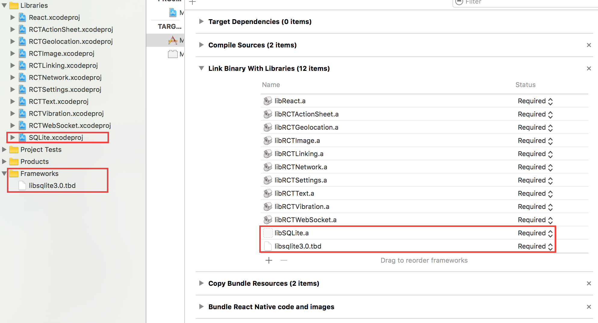
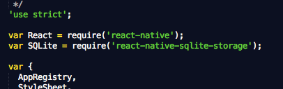

# React-native-sqlite-storage
Plugin SQLite3 nativo para React Native para ambos Android (Clássico e Nativo), iOS e Windows.

Foundation of this library is based on Chris Brody's Cordova SQLite plugin.

## Traduções
- [English](README.md)

Recursos:
1.	iOS e Android suportados via JavaScript API idêntico.
2.	Android em Java puro e modos nativos.
3.	Transações SQL.
4.	Interface JavaScript via retorno de chamada simples ou Promise.
5.	Importação de banco de dados SQLite pré-preenchida do pacote de aplicativos e da área restrita.
6.	Windows suporta retorno de chamada API, idêntico a iOS e Android.

Existem aplicativos de amostra fornecidos no diretório de teste que podem ser usados com o AwesomeProject gerados pelo React Native. Tudo o que precisa fazer é copiar um desses arquivos no seu AwesomeProject substituindo index.ios.js.

Por favor, me deixe conhecer seus projetos que usam esses módulos SQLite React Native. Vou lista-os na seção de referências. Se houver algum recurso que achar que beneficiaria essa biblioteca, por favor poste-o.

Essa biblioteca foi testada com React 16.2 (e anteriores) e XCode 7,8,9 – funciona bem se a necessidade de ajustes ou alterações de código. Para XCode 7,8 vs. XCode 6, a única diferença é que o sufixo do nome da biblioteca ios sqlite é tbd ao invés de dylib.

A versão 3.2 é a primeira versão compatível com RN 0.40.

# Installation
```
  npm install --save react-native-sqlite-storage
```
Em seguida, siga as instruções da sua plataforma para vincular react-native-sqlite-storage no seu projeto.

## Promises
Para habilitar as promises, execute
```javascript
SQLite.enablePromise(true);
```

## iOS
#### método padrão
** React Native 0.60 e acima ** execute cd ios && pod install && cd ... A vinculação não é requerida em React Native 0.60 e acima.

** React Native 0.59 e abaixo **

#### Passo 1. Instalar dependências 

##### Com CocoaPods:

Adicione isso ao seu Podfile que deve estar localizado dentro do subdiretório do projeto ios 
```ruby
pod 'React', :path => '../node_modules/react-native'
pod 'react-native-sqlite-storage', :path => '../node_modules/react-native-sqlite-storage'
```
Ou use o Podfile de amostra incluído no pacote copiando-o para o subdiretório ios e substituindo AwesomeProject dentro dele pelo nome do seu projeto RN.

Atualize a instalação dos Pods
```ruby
pod install
```
OR
```ruby
pod update
```

Feito isso, passe para o passo 2.

##### Sem CocoaPods:

Esse comando deve ser executado no diretório raiz do seu projeto RN.
```shell
react-native link
```

rnpm e xcode são dependências desse projeto e devem ser instalados com o modulo, mas caso haja problemas ao executar o link rnpm e o rnpm/xcode ainda não estiver instalado, você pode tentar instalá-lo globalmente da seguinte forma:
```shell
npm -g install rnpm xcode
```
Depois de vincular o projeto deve ficar assim:



#### Passo 1a. Se o link rnpm não funcionar para você, você pode tentar vincular manualmente de acordo com as instruções abaixo: 


##### Arraste o projeto SQLite Xcode como um projeto de dependência no seu projeto React Native Xcode.


##### Configuração de dependência de bibliotecas XCode SQLite

Adicione libSQLite.a (da localização Workspace) para as bibliotecas e estruturas necessárias. Adicione também sqlite3.0.tbd (XCode 7) ou libsqlite3.0.dylib (XCode 6 e anteriores) da mesma forma usando a visualização Bibliotecas requeridas (não basta adiciona-los manualmente, pois os caminhos de compilação não serão corretamente definidos)    


#### Passo 2. O aplicativo do JavaScript requer

Adicione var SQLite = require('react-native-sqlite-storage') no seu index.ios.js



#### Passo 3. Escreva o código JavaScript do aplicativo usando o plugin SQLite 

Adicione o código do aplicativo JS para usar o API SQLite no seu index.ios.js etc. Aqui estão alguns códigos de amostra. Para exemplo de funcionamento completo veja test/index.ios.callback.js. Note que o API baseado em Promise agora é compatível com exemplos completos no aplicativo React Native em test/index.ios.promise.js.

```javascript
errorCB(err) {
  console.log("SQL Error: " + err);
},

successCB() {
  console.log("SQL executed fine");
},

openCB() {
  console.log("Database OPENED");
},

var db = SQLite.openDatabase("test.db", "1.0", "Test Database", 200000, openCB, errorCB);
db.transaction((tx) => {
  tx.executeSql('SELECT * FROM Employees a, Departments b WHERE a.department = b.department_id', [], (tx, results) => {
      console.log("Query completed");

      // Get rows with Web SQL Database spec compliance.

      var len = results.rows.length;
      for (let i = 0; i < len; i++) {
        let row = results.rows.item(i);
        console.log(`Employee name: ${row.name}, Dept Name: ${row.deptName}`);
      }

      // Alternatively, you can use the non-standard raw method.

      /*
        let rows = results.rows.raw(); // shallow copy of rows Array

        rows.map(row => console.log(`Employee name: ${row.name}, Dept Name: ${row.deptName}`));
      */
    });
});
```

# Como usar (Android)
** React Native 0.60 e acima ** 
Se você desejar usar os dispositivos SQLite não há etapas extras. No entanto, se desejar usar o SQLite empacotado nessa biblioteca (incluindo suporte para FTS5), adicione o seguinte ao seu `react-native.config.js`

```js
module.exports = {
  ...,
  dependencies: {
    ...,
    "react-native-sqlite-storage": {
      platforms: {
        android: {
          sourceDir:
            "../node_modules/react-native-sqlite-storage/platforms/android-native",
          packageImportPath: "import io.liteglue.SQLitePluginPackage;",
          packageInstance: "new SQLitePluginPackage()"
        }
      }
    }
    ...
  }
  ...
};
```

** React Native 0.59 e abaixo **

#### Passo 1 – Atualização de configurações do Gradle (localizado nas Configurações do Gradle no painel do projeto)


```gradle
// file: android/settings.gradle
...

include ':react-native-sqlite-storage'
project(':react-native-sqlite-storage').projectDir = new File(rootProject.projectDir, '../node_modules/react-native-sqlite-storage/platforms/android') // react-native-sqlite-storage >= 4.0.0
// IMPORTANT: if you are working with a version less than 4.0.0 the project directory is '../node_modules/react-native-sqlite-storage/src/android'
```

#### Passo 2 – Atualização do script Gradle Build do módulo do aplicativo (localizado nas Configurações do Gradle no painel do projeto)

```gradle
// file: android/app/build.gradle
...

dependencies {
    ...
    implementation project(':react-native-sqlite-storage')
}
```

#### Passo 3 – Registro do pacote React (isso deve funcionar na versão React, mas caso não funcione, tente a abordagem baseada em ReactActivity. Nota: para versões 3.0.0 e abaixo você teria que passar a instancia de sua Activity para o construtor SQLitePluginPackage.

```java
...
import org.pgsqlite.SQLitePluginPackage;

public class MainActivity extends Activity implements DefaultHardwareBackBtnHandler {

    private ReactInstanceManager mReactInstanceManager;
    private ReactRootView mReactRootView;

    @Override
    protected void onCreate(Bundle savedInstanceState) {
        super.onCreate(savedInstanceState);
        mReactRootView = new ReactRootView(this);
        mReactInstanceManager = ReactInstanceManager.builder()
                .setApplication(getApplication())
                .setBundleAssetName("index.android.bundle")  // this is dependant on how you name you JS files, example assumes index.android.js
                .setJSMainModuleName("index.android")        // this is dependant on how you name you JS files, example assumes index.android.js
                .addPackage(new MainReactPackage())
                .addPackage(new SQLitePluginPackage())       // register SQLite Plugin here
                .setUseDeveloperSupport(BuildConfig.DEBUG)
                .setInitialLifecycleState(LifecycleState.RESUMED)
                .build();
        mReactRootView.startReactApplication(mReactInstanceManager, "AwesomeProject", null); //change "AwesomeProject" to name of your app
        setContentView(mReactRootView);
    }
...

```

Abordagem alternativa nas versões mais recentes do React Native (0.18+). Nota: para versões 3.0.0 e abaixo você teria que passar a instancia de sua Activity para o construtor SQLitePluginPackage.

```java
import org.pgsqlite.SQLitePluginPackage;

public class MainApplication extends Application implements ReactApplication {
  ......

  /**
   * A list of packages used by the app. If the app uses additional views
   * or modules besides the default ones, add more packages here.
   */
    @Override
    protected List<ReactPackage> getPackages() {
      return Arrays.<ReactPackage>asList(
        new SQLitePluginPackage(),   // register SQLite Plugin here
        new MainReactPackage());
    }
}
```

#### Passo 4 – Exigir e usar em JavaScript – veja exemplos completos (retorno de chamada e Promises) no diretório de teste.

```js
// file: index.android.js

var React = require('react-native');
var SQLite = require('react-native-sqlite-storage')
...
```

## Windows
** RNW 0.60 com vinculação automática e acima **

Não há etapas manuais exigidas.

** React Native 0.62 **
### Step 1: Update the solution file

Adicione o projeto  `SQLitePlugin` no seu projeto principal do aplicativo. Do Visual Studio 2019:

1.	Abra a solução no Visual Studio 2019
2.	Clique com o botão direito do mouse no ícone Solução em Explorador de Soluções > Adicionar > Projeto Existente
3.	Selecionar  `node_modules\react-native-sqlite-storage\platforms\windows\SQLitePlugin\SQLitePlugin.vcxproj`

### Passo 2: Atualização do arquivo .vcxproj

Adicione uma referência ao `SQLitePlugin` no seu projeto principal do aplicativo. Do Visual Studio 2019:

1.	Clique com o botão direito do mouse no projeto do aplicativo principal > Adicionar > Referências...
2.	Confira `SQLitePlugin` a partir de projetos de soluções 


Passo 3: Atualização do arquivo `pch.h`

Adicione `#include "winrt/SQLitePlugin.h"`.

### Passo 4: Registro do pacote em `App.cpp`

Adicione `PackageProviders().Append(winrt::SQLitePlugin::ReactPackageProvider());` antes de `InitializeComponent();`.

Consulte esse guia para mais detalhes: https://microsoft.github.io/react-native-windows/docs/next/native-modules-using


## Configurando seu projeto para importar um banco de dados SQLite pré-preenchida de um aplicativo para IOS

#### Passo 1 – Crie uma pasta 

Crie uma pasta chamada ‘www’ (sim deve ser chamado precisamente se não as coisas não vão funcionar) na pasta do projeto via Finder.  

#### Passo 2 – Crie o arquivo do banco de dados 

Copie/cole seu arquivo do banco de dados pré-preenchido para a pasta ‘www’. Dê o mesmo nome que você vai usar na chamada openDatabase no seu aplicativo.

#### Adicione o arquivo ao projeto

No XCode, clique com o botão direito do mouse na pasta principal e selecione Adicionar Arquivos no ‘nome do seu projeto’


#### Passo 4 – Escolha os arquivos para adicionar 

 Na caixa de dialogo Adicionar Arquivos, navegue pelo diretório ‘www’ que você criou no Passo 1, selecione-o, certifique-se de marcar a opção de Criar uma referência na pasta


#### Passo 5 – Verifique a estrutura do projeto

Certifique-se que a estrutura do seu projeto depois que os passos anteriores foram executados se pareça com isso 


### Passo 6 – Ajustando a chamada openDatabase

Modifique sua chamada openDatabase no seu aplicativo adicionando o parâmetro createFromLocation. Se no Passo 2 você nomeou seu arquivo de banco de dados como ‘testDB’, a chamada openDatabase deve se parecer com isso:
```js

  ...
  1.SQLite.openDatabase({name : "testDB", createFromLocation : 1}, okCallback,errorCallback);
  // default - if your folder is called www and data file is named the same as the dbName - testDB in this example
  2.SQLite.openDatabase({name : "testDB", createFromLocation : "~data/mydbfile.sqlite"}, okCallback,errorCallback);
  // if your folder is called data rather than www or your filename does not match the name of the db
  3.SQLite.openDatabase({name : "testDB", createFromLocation : "/data/mydbfile.sqlite"}, okCallback,errorCallback);
  // if your folder is not in app bundle but in app sandbox i.e. downloaded from some remote location.
  ...

```
Para Android, o diretório www é sempre relativo ao diretório de ativos (assets) para o app: src/main/assets.

## Abrindo o banco de dados
Abrir um banco de dados é levemente diferente entre iOS e Android. Enquanto no Android a localização do arquivo do banco de dados é fixa, existem três opções de onde o arquivo do banco de dados pode ser encontrado no iOS. O parâmetro ‘location’ que você fornece para a chamada openDatabase indica onde você gostaria de criar o arquivo. Esse parâmetro é negligenciado no Android.

AVISO: a localização padrão no iOS mudou na versão 3.0.0 – é agora um local sem sincronização a mando da Apple, então o lançamento é incompatível com versões anteriores. 

Para abrir o banco de dados no local sem sincronização (funciona apenas no iOS):

```js
SQLite.openDatabase({name: 'my.db', location: 'default'}, successcb, errorcb);
```

Para localização especifica diferente (funciona apenas no iOS):

```js
SQLite.openDatabase({name: 'my.db', location: 'Library'}, successcb, errorcb);
```

Enquanto a opção `location` pode ser definida a uma dessas escolhas abaixo: 
- `default`: subdiretório  `Library/LocalDatabase` – NÃO visível para iTunes e NÃO suportado pelo iCloud
- `Library`: subdiretório  `Library` – suportado pelo iCloud, NÃO visível para iTunes
- `Documents`: subdiretório  `Documents` – visível para iTunes e suportado pelo iCloud
- `Shared`:  contêiner compartilhado do grupo de aplicativos – consulte a próxima seção.

O estilo original do webSql openDatabase continua funcionando e a localização será implicitamente padrão para a opção ‘default’:

```js
SQLite.openDatabase("myDatabase.db", "1.0", "Demo", -1);
```

## Abrindo um banco de dados em um contêiner compartilhado do grupo de aplicativos (iOS)

Se você possui uma extensão de aplicativo iOS que precise compartilhar o acesso à mesma instancia DB que seu aplicativo principal, você deve usar o contêiner compartilhado de um grupo de aplicativos.

Assumindo que você já configurou um grupo de aplicativos e ativou o direito a “Grupo de Aplicativos” de ambos os aplicativos principais e extensões de aplicativos, configurou-os ao mesmo de nome de grupo de aplicativos, os próximos passos extras devem ser tomados:

#### fornecendo o nome do seu grupo de aplicativos em todos os itens `Info.plist` necessários.

Em ambos `ios/MY_APP_NAME/Info.plist` e `ios/MY_APP_EXT_NAME/Info.plist` (junto a qualquer outra extensão de aplicativo que você tenha) você simplesmente precisa adicionar a chave `AppGroupName`ao dicionário principal com seu nome de grupo de aplicativo com o valor da string:

```xml
<plist version="1.0">
<dict>
  <!-- ... -->
  <key>AppGroupName</key>
  <string>MY_APP_GROUP_NAME</string>
  <!-- ... -->
</dict>
</plist>
```

#### Passo 2 – definindo o local do banco de dados compartilhado

Quando chamar `SQLite.openDatabase` em seu codigo React Native, você precisa definir o parâmetro `location` para `'Shared'`:

```js
SQLite.openDatabase({name: 'my.db', location: 'Shared'}, successcb, errorcb);
```

## Importando e pré-populado Database

Você pode importar um arquivo de banco de dados pré-populado para seu aplicativo. Dependendo de suas instruções na chamada openDatabase, o sqlite-storage procurará em lugares diferentes para localizar seu arquivo de banco de dados pré-preenchido.

Use este tipo de chamada do openDatabase se sua pasta for chamada www e o arquivo de dados tiver o mesmo nome que dbName - testDB neste exemplo

```js
SQLite.openDatabase({name : "testDB", createFromLocation : 1}, okCallback,errorCallback);
```

Use este tipo de chamada do openDatabase se sua pasta for chamada data em vez de www ou se seu nome de arquivo não corresponder ao nome do banco de dados. Neste caso, db é denominado testDB, mas o arquivo é mydbfile.sqlite, localizado em um subdiretório de dados de www

```js
SQLite.openDatabase({name : "testDB", createFromLocation : "~data/mydbfile.sqlite"}, okCallback,errorCallback);
```

Use este tipo de chamada openDatabase se sua pasta não estiver no pacote de aplicativos, mas na caixa de proteção do aplicativo, ou seja, baixada de algum local remoto. Nesse caso, o arquivo de origem está localizado no subdiretório de dados do local de Documents (iOS) ou FilesDir (Android).

```js
SQLite.openDatabase({name : "testDB", createFromLocation : "/data/mydbfile.sqlite"}, okCallback,errorCallback);
```

## Opções adicionais para arquivo de banco de dados pré-populando

Você pode fornecer instruções adicionais para sqlite-storage e dizer como lidar com seu arquivo de banco de dados pré-populando. Por padrão, o arquivo de origem é copiado para o local interno, o que funciona na maioria dos casos, mas às vezes isso não é realmente uma opção, especialmente quando o arquivo db de origem é grande. Em tais situações, você pode dizer ao sqlite-storage que não deseja copiar o arquivo, mas sim usá-lo somente para leitura por meio de acesso direto. Você consegue isso fornecendo um parâmetro readOnly opcional e adicional para a chamada do openDatabase

```js
SQLite.openDatabase({name : "testDB", readOnly: true, createFromLocation : "/data/mydbfile.sqlite"}, okCallback,errorCallback);
```

Observe que, neste caso, o arquivo db de origem será aberto no modo somente leitura e nenhuma atualização será permitida. Você não pode excluir um banco de dados que foi aberto com a opção readOnly. Para Android, a opção somente leitura funciona com arquivos db pré-populados localizados no diretório FilesDir porque todos os outros recursos nunca são localizados fisicamente no sistema de arquivos, mas lidos diretamente do pacote de aplicativos.

## Anexando outro banco de dados

Sqlite3 offers the capability to attach another database to an existing database-instance, i.e. for making cross database JOINs available.
This feature allows to SELECT and JOIN tables over multiple databases with only one statement and only one database connection.
To archieve this, you need to open both databases and to call the attach()-method of the destination (or master) -database to the other ones.

O Sqlite3 oferece a capacidade de anexar outro banco de dados a uma instância de banco de dados existente, ou seja, para disponibilizar JOIN entre bancos de dados.
Esse recurso permite SELECT e JOIN tabelas em vários bancos de dados com apenas uma instrução e apenas uma conexão de banco de dados.
Para arquivar isso, você precisa abrir os dois bancos de dados e chamar o método attach() do banco de dados de destino (ou do mestre) para os outros.

```js
let dbMaster, dbSecond;

dbSecond = SQLite.openDatabase({name: 'second'},
  (db) => {
    dbMaster = SQLite.openDatabase({name: 'master'},
      (db) => {
        dbMaster.attach( "second", "second", () => console.log("Database attached successfully"), () => console.log("ERROR"))
      },
      (err) => console.log("Error on opening database 'master'", err)
    );
  },
  (err) => console.log("Error on opening database 'second'", err)
);
```

O primeiro argumento de attach() é o nome do banco de dados, que é usado no SQLite.openDatabase(). O segundo argumento é o alias, que é usado para consultar tabelas do banco de dados anexado.

A instrução a seguir selecionaria dados do banco de dados mestre e incluiria no "segundo" banco de dados em uma simples instrução de SELECT/JOIN:

```sql
SELECT * FROM user INNER JOIN second.subscriptions s ON s.user_id = user.id
```

To detach a database, just use the detach()-method:

```js
dbMaster.detach( 'second', successCallback, errorCallback );
```

Com certeza, o suporte ao Promise também está disponível para attach() e detach(), conforme mostrado no aplicativo de exemplo sob o
diretório "exemplos".

# Um Original de Cordova SQLite Bindings de Chris Brody e Davide Bertola
https://github.com/litehelpers/Cordova-sqlite-storage

Os problemas e limitações do SQLite real podem ser encontrados neste site.

## Problemas

1. O Android vincula todos os valores numéricos de entrada SQL ao dobro. Isso se deve à limitação subjacente do React Native, em que apenas um tipo numérico está disponível no ponto de interface, tornando ambíguo distinguir inteiros de dobles. Depois de descobrir a maneira correta de fazer isso, atualizarei a base de código [(Problema nº 4141)] (https://github.com/facebook/react-native/issues/4141).
