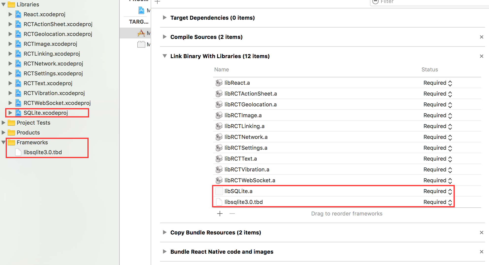

# react-native-sqlite-storage
SQLite3 Native Plugin for React Native for both Android (Classic and Native) and iOS

Inspired by fantastic work done by Chris Brody I did not want to re-invent the wheel. The original Cordova plugin was written so well and adhered to latest WebSQL API that there was no need to come up with anything much different. So the Cordova plugin was ported to React Native.

Features:
  1. iOS and Android supported via identical JavaScript API.
  2. Android in pure Java and Native modes
  3. SQL transactions
  4. JavaScript interface via plain callbacks or Promises.
  5. Pre-populated SQLite database import from application bundle and sandbox

Please let me know your projects that use these SQLite React Native modules. I will list them in the reference section. If there are any features that you think would benefit this library please post them.

The library has been tested with React 0.21.0 (and earlier) and XCode 7 - it works fine out of the box without any need for tweaks or code changes. For XCode 7 vs. XCode 6 the only difference is that sqlite ios library name suffix is tbd instead of dylib. Version 3.1.3 is not compatible with RN 0.40.

#Version History

v3.2 (upcoming)
 1. React Native 0.40 compatibility
 
v3.1.3
 1. Add support for ATTACH (thanks to itinance for this contribution)
 2. Example applications are now hosted in separate repo [react-native-sqlite-examples] (https://github.com/andpor/react-native-sqlite-storage-examples)


v3.1.2
 1. Add support for CocoaPods (thanks to JAStanton for this contribution)
 2. Set base iOS build to 8.0

v3.1.1
 1.  Fix for Cordova issue #517: reject ALTER, REINDEX and REPLACE operations in readTransactions
 2.  Stop remaining transaction callback in case of an error with no error handler returning false

v3.1.0
 1. Backward incompatible change. Boolean params will now be converted and stored as int type, 0 and 1, in compliance with SQLite specifications. Issue [#63] (https://github.com/andpor/react-native-sqlite-storage/issues/63)
 2. Database decoupled from the Activity lifecycle on Android. With this change, the database will not be closed without explicit instructions to close it. SQLitePluginPackage constructor change. Pull Request [#62] (https://github.com/andpor/react-native-sqlite-storage/pull/62)
 3. Correct handling for executeSql with object as sql value (solves a possible crash on iOS)
 4. Backfill cordova-sqlite-storage fix - readTransaction allows modification in case of extra semicolon before SQL. Issue [#460] (https://github.com/litehelpers/Cordova-sqlite-storage/issues/460)

v3.0.0
 1. Default location changes for iOS for App Store iCloud compliance - backward incompatible release. Default now is no-sync location instead of docs.
 2. Ability to point to read-only db file in app bundle directly without requiring it to be copied elsewhere.
 2. Check if db is open before throwing an exception (triggered in android lock workaround)
 3. Fix for issue #57. Can't find variable: Blob

v2.1.6
 1. rnpm linking for iOS - contributed by @clozr
 2. Backfill Cordova read transaction bug fix.

v2.1.5
 1. Allow retrieval of pre-populated db files from user defined locations in application bundle as well as the sandbox.
 2. Implement Activity lifecycle mgmt in Android native
 3. Fix issue [#37] (https://github.com/andpor/react-native-sqlite-storage/issues/37) - Int Column type value overflow
 4. Fix issue [#38] (https://github.com/andpor/react-native-sqlite-storage/issues/38) - Transactions not aborted with Promise runtime
 5. Backfill fixes from Cordova SQLite Storage
    - add sqlBatch to facilitate batch exec of simple SQL statements (Android + iOS)
    - add echoTest for plugin integrity test

v2.1.4 - tested with React 0.21.0
 1. Expose a bulk data retrieval interface from JS
 2. Fix JS 'strict' mode execution errors

v2.1.3
 1. Fix the runtime error in reflection.

v2.1.2
 1. Android Native SQLite connectivity
 2. Change how React parameters are processed to map a Number to Java Double
 3. Implement hooks for activity lifecycle and automatic db closing on destroy
 4. Fix How To Get Started instructions for Android

v2.1.1 - Fixes issues with XCode path and React Native version compatibility

v2.1 - Android support

v2.0 - Full support for Promise API. Backward compatible with Callbacks.

v1.0 - Initial release for iOS with full support of all operations based on plan JavaScript callbacks.

#How to use (iOS):

#### Step 1. Install Dependencies

##### With CocoaPods:

```shell
npm install --save react-native-sqlite-storage
```
Then add this to your Podfile
```ruby
pod 'react-native-sqlite-storage', :path => './node_modules/react-native-sqlite-storage'
```

Done, skip to Step 2.

##### Without CocoaPods:

```shell
npm install --save react-native-sqlite-storage
rnpm link
```

rnpm and xcode are dependencies of this project and should get installed with the module but in case there are issue running rnpm link and rnpm/xcode are not already installed you can try to install it globally as follows:
```shell
npm -g install rnpm xcode
```
After linking project should like this:



#### Step 1a. If rnpm link does not work for you you can try manually linking according to the instructions below:


##### Drag the SQLite Xcode project as a dependency project into your React Native XCode project


##### XCode SQLite libraries dependency set up

Add libSQLite.a (from Workspace location) to the required Libraries and Frameworks. Also add sqlite3.0.tbd (XCode 7) or libsqlite3.0.dylib (XCode 6 and earlier) in the same fashion using Required Libraries view (Do not just add them manually as the build paths will not be properly set)


#### Step 2. Application JavaScript require

Add var SQLite = require('react-native-sqlite-storage') to your index.ios.js


#### Step 3. Write application JavaScript code using the SQLite plugin

Add JS application code to use SQLite API in your index.ios.js etc. Here is some sample code. For full working example see test/index.ios.callback.js. Please note that Promise based API is now supported as well with full examples in the working React Native app under test/index.ios.promise.js

```javascript
errorCB(err) {
  console.log("SQL Error: " + err);
},

successCB() {
  console.log("SQL executed fine");
},

openCB() {
  console.log("Database OPENED");
},

var db = SQLite.openDatabase("test.db", "1.0", "Test Database", 200000, openCB, errorCB);
db.transaction((tx) => {
  tx.executeSql('SELECT * FROM Employees a, Departments b WHERE a.department = b.department_id', [], (tx, results) => {
      console.log("Query completed");

      // Get rows with Web SQL Database spec compliance.

      var len = results.rows.length;
      for (let i = 0; i < len; i++) {
        let row = results.rows.item(i);
        console.log(`Employee name: ${row.name}, Dept Name: ${row.deptName}`);
      }

      // Alternatively, you can use the non-standard raw method.

      /*
        let rows = results.rows.raw(); // shallow copy of rows Array

        rows.map(row => console.log(`Employee name: ${row.name}, Dept Name: ${row.deptName}`));
      */
    });
});
```

#How to use (Android):

#### Step 1 - NPM Install

```shell
npm install --save react-native-sqlite-storage
```
#### Step 2 - Update Gradle Settings

```gradle
// file: android/settings.gradle
...

include ':react-native-sqlite-storage'
project(':react-native-sqlite-storage').projectDir = new File(rootProject.projectDir, '../node_modules/react-native-sqlite-storage/src/android')
```

#### Step 3 - Update app Gradle Build

```gradle
// file: android/app/build.gradle
...

dependencies {
    ...
    compile project(':react-native-sqlite-storage')
}
```

#### Step 4 - Register React Package (this should work on React version but if it does not , try the ReactActivity based approach. Note: for version 3.0.0 and below you would have to pass in the instance of your Activity to the SQLitePluginPackage constructor

```java
...
import org.pgsqlite.SQLitePluginPackage;

public class MainActivity extends Activity implements DefaultHardwareBackBtnHandler {

    private ReactInstanceManager mReactInstanceManager;
    private ReactRootView mReactRootView;

    @Override
    protected void onCreate(Bundle savedInstanceState) {
        super.onCreate(savedInstanceState);
        mReactRootView = new ReactRootView(this);
        mReactInstanceManager = ReactInstanceManager.builder()
                .setApplication(getApplication())
                .setBundleAssetName("index.android.bundle")  // this is dependant on how you name you JS files, example assumes index.android.js
                .setJSMainModuleName("index.android")        // this is dependant on how you name you JS files, example assumes index.android.js
                .addPackage(new MainReactPackage())
                .addPackage(new SQLitePluginPackage())       // register SQLite Plugin here
                .setUseDeveloperSupport(BuildConfig.DEBUG)
                .setInitialLifecycleState(LifecycleState.RESUMED)
                .build();
        mReactRootView.startReactApplication(mReactInstanceManager, "AwesomeProject", null); //change "AwesomeProject" to name of your app
        setContentView(mReactRootView);
    }
...

```

Alternative approach on newer versions of React Native (0.18+). Note: for version 3.0.0 and below you would have to pass in the instance of your Activity to the SQLitePluginPackage constructor

```java
import org.pgsqlite.SQLitePluginPackage;

public class MainApplication extends Application implements ReactApplication {
  ......

  /**
   * A list of packages used by the app. If the app uses additional views
   * or modules besides the default ones, add more packages here.
   */
    @Override
    protected List<ReactPackage> getPackages() {
      return Arrays.<ReactPackage>asList(
        new SQLitePluginPackage(),   // register SQLite Plugin here
        new MainReactPackage());
    }
}
```

#### Step 5 - Require and use in Javascript - see full examples (callbacks and Promise) in test directory.

```js
// file: index.android.js

var React = require('react-native');
var SQLite = require('react-native-sqlite-storage')
...
```

## Setting up your project to import a pre-populated SQLite database from application for iOS

#### Step 1 - Create 'www' folder.

Create a folder called 'www' (yes must be called precisely that else things won't work) in the project folder via Finder

#### Step 2 - Create the database file

Copy/paste your pre-populated database file into the 'www' folder. Give it the same name you are going to use in openDatabase call in your application

#### Step 3 - Add file to project

in XCode, right click on the main folder and select Add Files to 'your project name'


#### Step 4 - Choose files to add

In the Add Files dialog, navigate to the 'www' directory you created in Step 1, select it, make sure you check the option to Create Folder Reference


#### Step 5 - Verify project structure

Ensure your project structure after previous steps are executed looks like this


### Step 6 - Adjust openDatabase call

Modify you openDatabase call in your application adding createFromLocation param. If you named your database file in step 2 'testDB' the openDatabase call should look like something like this:
```js

  ...
  1.SQLite.openDatabase({name : "testDB", createFromLocation : 1}, okCallback,errorCallback);
  // default - if your folder is called www and data file is named the same as the dbName - testDB in this example
  2.SQLite.openDatabase({name : "testDB", createFromLocation : "~data/mydbfile.sqlite"}, okCallback,errorCallback);
  // if your folder is called data rather than www or your filename does not match the name of the db
  3.SQLite.openDatabase({name : "testDB", createFromLocation : "/data/mydbfile.sqlite"}, okCallback,errorCallback);
  // if your folder is not in app bundle but in app sandbox i.e. downloaded from some remote location.
  ...

```
For Android, the www directory is always relative to the assets directory for the app: src/main/assets

Enjoy!

## Opening a database

Opening a database is slightly different between iOS and Android. Where as on Android the location of the database file is fixed, there are three choices of where the database file can be located on iOS. The 'location' parameter you provide to openDatabase call indicated where you would like the file to be created. This parameter is neglected on Android.

WARNING: the default location on iOS has changed in version 3.0.0 - it is now a no-sync location as mandated by Apple so the release is backward incompatible.


To open a database in default no-sync location (affects iOS *only*)::

```js
SQLite.openDatabase({name: 'my.db', location: 'default'}, successcb, errorcb);
```

To specify a different location (affects iOS *only*):

```js
SQLite.openDatabase({name: 'my.db', location: 'Library'}, successcb, errorcb);
```

where the `location` option may be set to one of the following choices:
- `default`: `Library/LocalDatabase` subdirectory - *NOT* visible to iTunes and *NOT* backed up by iCloud
- `Library`: `Library` subdirectory - backed up by iCloud, *NOT* visible to iTunes
- `Documents`: `Documents` subdirectory - visible to iTunes and backed up by iCloud

The original webSql style openDatabase still works and the location will implicitly default to 'default' option:

```js
SQLite.openDatabase("myDatabase.db", "1.0", "Demo", -1);
```


## Importing a pre-populated database.

You can import an existing - prepopulated database file into your application. Depending on your instructions in openDatabase call, the sqlite-storage will look at different places to locate you pre-populated database file.


Use this flavor of openDatabase call, if your folder is called www and data file is named the same as the dbName - testDB in this example

```js
SQLite.openDatabase({name : "testDB", createFromLocation : 1}, okCallback,errorCallback);
```

Use this flavor of openDatabase call if your folder is called data rather than www or your filename does not match the name of the db. In this case db is named testDB but the file is mydbfile.sqlite which is located in a data subdirectory of www

```js
SQLite.openDatabase({name : "testDB", createFromLocation : "~data/mydbfile.sqlite"}, okCallback,errorCallback);
```

Use this flavor of openDatabase call if your folder is not in application bundle but in app sandbox i.e. downloaded from some remote location. In this case the source file is located in data subdirectory of Documents location (iOS) or FilesDir (Android).

```js
SQLite.openDatabase({name : "testDB", createFromLocation : "/data/mydbfile.sqlite"}, okCallback,errorCallback);
```

## Additional options for pre-populated database file

You can provide additional instructions to sqlite-storage to tell it how to handle your pre-populated database file. By default, the source file is copied over to the internal location which works in most cases but sometimes this is not really an option particularly when the source db file is large. In such situations you can tell sqlite-storage you do not want to copy the file but rather use it in read-only fashion via direct access. You accomplish this by providing an additional optional readOnly parameter to openDatabase call

```js
SQLite.openDatabase({name : "testDB", readOnly: true, createFromLocation : "/data/mydbfile.sqlite"}, okCallback,errorCallback);
```

Note that in this case, the source db file will be open in read-only mode and no updates will be allowed. You cannot delete a database that was open with readOnly option. For Android, the read only option works with pre-populated db files located in FilesDir directory because all other assets are never physically located on the file system but rather read directly from the app bundle.

## Attaching another database

Sqlite3 offers the capability to attach another database to an existing database-instance, i.e. for making cross database JOINs available.
This feature allows to SELECT and JOIN tables over multiple databases with only one statement and only one database connection.
To archieve this, you need to open both databases and to call the attach()-method of the destination (or master) -database to the other ones.

```js
let dbMaster, dbSecond;

dbSecond = SQLite.openDatabase({name: 'second'},
  (db) => {
    dbMaster = SQLite.openDatabase({name: 'master'},
      (db) => {
        dbMaster.attach( "second", "second", () => console.log("Database attached successfully"), () => console.log("ERROR"))
      },
      (err) => console.log("Error on opening database 'master'", err)
    );
  },
  (err) => console.log("Error on opening database 'second'", err)
);
```

The first argument of attach() is the name of the database, which is used in SQLite.openDatabase(). The second argument is the alias, that is used to query on tables of the attached database.

The following statement would select data from the master database and include the "second"-database within a simple SELECT/JOIN-statement:

```sql
SELECT * FROM user INNER JOIN second.subscriptions s ON s.user_id = user.id
```

To detach a database, just use the detach()-method:

```js
dbMaster.detach( 'second', successCallback, errorCallback );
```

For sure, their is also Promise-support available for attach() and detach(), as shown in the example-application under the
directory "examples".

#Original Cordova SQLite Bindings from Chris Brody
https://github.com/litehelpers/Cordova-sqlite-storage

The issues and limitations for the actual SQLite can be found on this site.

##Issues

1. Android binds all numeric SQL input values to double. This is due to the underlying React Native limitation where only a Numeric type is available on the interface point making it ambiguous to distinguish integers from doubles. Once I figure out the proper way to do this I will update the codebase [(Issue #4141)] (https://github.com/facebook/react-native/issues/4141).
